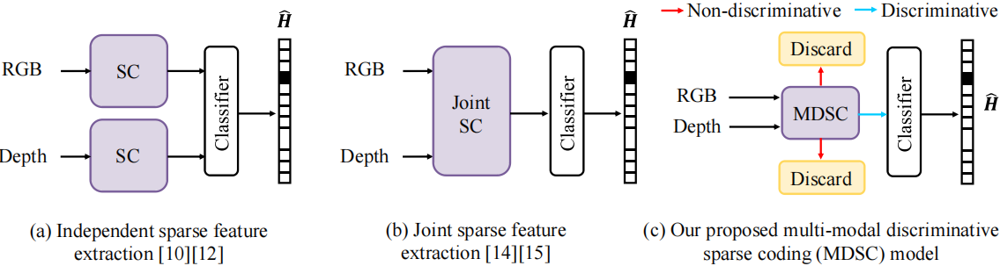

# MDSC-Net: Multi-modal Discriminative Sparse Coding Driven RGB-D Classification Network
- This is the official repository of the paper "MDSC-Net: Multi-modal Discriminative Sparse Coding Driven RGB-D Classification Network" from **IEEE Transactions on Multimedia (TMM)**. [[Paper Link]](https://ieeexplore.ieee.org/abstract/document/9774926, "Paper Link")

<div style="text-align: center;">
    Fig.1. The illustration about the RGB-D feature fusion difference between our proposed MDSC model and other sparse based methods.
</div>


<div style="text-align: center;">
    Fig.2. The motivation and pipeline of the proposed MDSC model.
</div>


<div style="text-align: center;">
    Fig.3. The network architecture of the proposed MDSC-Net.
</div>


## 1. Environment
- Python >= 3.5
- PyTorch == 1.7.1 is recommended
- opencv-python = =3.4.9.31
- tqdm
- scikit-image == 0.15.0
- scipy == 1.3.1 
- Matlab

## 2. Training and testing dataset
- For RGB-D image classification task,  adopt the ***Washington RGB-D object dataset (WRGBD)*** and the ***JHUIT-50 object dataset*** for training and testing
training and testing. 

All the training and testing images for classification task used in this paper can be downloaded from the [[Google Drive Link]](https://drive.google.com/drive/folders/1eQDce9fQ2vMBcTe_7FBN3lAk3PAjWdVR?usp=sharing)


## 3. Test
### 🛠️  Clone this repository:
```
    https://github.com/JingyiXu404/MDSC-Net.git
```
### 🛠️  Download pretrained models:
```
    https://drive.google.com/drive/folders/15lCYy0HyM1Q1Bw7rH29rJOaZqpmIhVaa?usp=sharing
```
### 💓  For RGB-D classification task
**1. Prepare dataset**: If you do not use same datasets as us, place the test images in `data/xxx_dataset/`.

```
    xxx_dataset
    └── category 1
        └── instance 1
            ├──  xxx_crop.png 
            ├──  ....
            └──  xxx_depthsn.png
        └── other instances from category 1
    └── category 2
        └── instance 1
            ├──  xxx_crop.png 
            ├──  ....
            └──  xxx_depthsn.png
        └── other instances from category 2
    └── other categories
   ```

**2. Setup configurations**: In `main.py`.

```
    "dataset_path": "/data/WRGBD/"
```

**3. Run**: 

```
   export PYTHONPATH=$PYTHONPATH:utils/
   python main.py --batch-size 32 --split-no [split number, from 1 to 10] --qloss ['True' for using discriminative loss, 'False' for not] --gpu 'True' --cu 'True' --phase 'test'
```

## 5. Citation
If you find our work useful in your research or publication, please cite our work:
```
release soon
```

## 6. Contact
If you have any question about our work or code, please email `jingyixu@buaa.edu.cn` .
